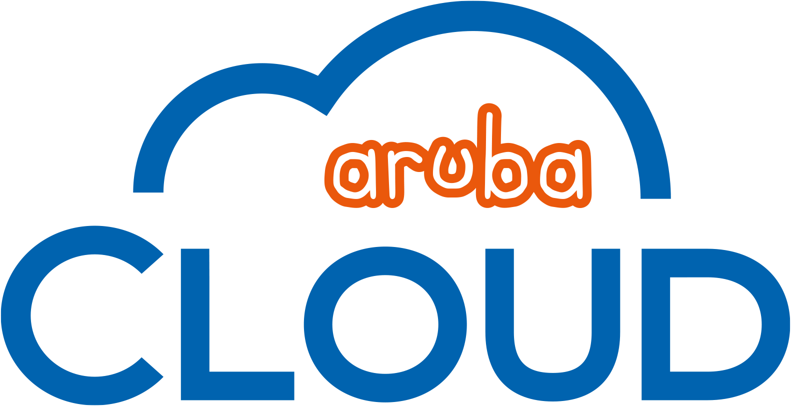

  

# DevSecOps2025 - Demo

This repository demonstrates a modern DevSecOps workflow for deploying:

- A static website hosted in Aruba Cloud Object Storage
- A customized WordPress image deployed in Aruba Managed Kubernetes via ArgoCD
- A Go REST microservice deployed on an Aruba Cloud Server and run via Docker Engine

Both the Go REST microservice and WordPress application use Aruba Cloud Database for data storage.

## Link

- [Static Web Site](https://devsecops2025.r3-it.storage.cloud.it/index.html)
- [REST API](https://api.devsecops2025-arubacloud.com)
- [Wordpress Backend](https://devsecops2025-arubacloud.com/wp-admin)
- [Wordpress Site](https://devsecops2025-arubacloud.com/)
- [ArgoCD](https://argocd.devsecops2025-arubacloud.com/wp-admin)
- [Vault](https://vault.devsecops2025-arubacloud.com/wp-admin)

## Structure

- `build/` — Source code and build assets (static site, Go REST microservice, WordPress Docker setup, etc.)
- `deploy/` — GitOps manifests and Kustomize overlays for deployment (Kubernetes, ArgoCD, etc.)
- `setup/` — Initialization guides and configuration files (Vault, External Secrets Operator, GitHub runner, etc.)
- `.github/workflows/` — CI/CD pipeline definitions

## Cloud Provider

**ArubaCloud:** [https://arubacloud.com](https://arubacloud.com)

  

**Services:**
- [CloudServer](https://kb.arubacloud.com/en/computing/cloud-servers.aspx)
- [KaaS](https://kb.arubacloud.com/cmp/en/container/kubernetes.aspx)
- [DbaaS](https://kb.arubacloud.com/en/database/cloud-dbaas.aspx)
- [Virtual Private Network](https://kb.arubacloud.com/cmp/en/networking/vpc-networks.aspx)
- [Subnet](https://kb.arubacloud.com/cmp/en/networking/vpc-networks/subnet.aspx)
- [Security Group](https://kb.arubacloud.com/cmp/en/networking/vpc-networks/security-group.aspx)
- [Elastic Ip](https://kb.arubacloud.com/cmp/en/networking/elastic-ip.aspx)
- [Load Balancer](https://kb.arubacloud.com/cmp/en/networking/load-balancer/description.aspx)
- [BlockStorage](https://kb.arubacloud.com/cmp/en/storage/block-storage.aspx)
- [Container Registry](https://kb.arubacloud.com/en/storage/object-storage.aspx)
- [Object Storage](https://kb.arubacloud.com/en/storage/object-storage.aspx)

## Getting Started

1. Build and push artifacts using GitHub Actions.
2. Deploy WordPress to Aruba Managed Kubernetes using Kustomize overlays and ArgoCD.
3. Deploy Go REST microservice to Aruba Cloud Server using Docker Engine.
4. Integrate Vault and External Secrets Operator for secure secrets management.
5. Host static site in Aruba Cloud Object Storage.

## Features

- **Static Website**: Hosted in Aruba Cloud Object Storage, automated CI/CD via GitHub Actions.
- **WordPress Deployment**: Customized WordPress image, deployed to Aruba Managed Kubernetes using ArgoCD, with custom plugins and secure configuration.
- **Go REST Microservice**: Containerized Go API for CRUD operations, deployed on Aruba Cloud Server via Docker Engine, connected to Aruba Cloud Database.
- **Kubernetes Manifests**: Managed with Kustomize for environment-specific overlays.
- **Secrets Management**: Secure integration with HashiCorp Vault and External Secrets Operator.
- **TLS & Ingress**: Automated TLS via cert-manager, flexible ingress configuration.
- **CI/CD Automation**: GitHub Actions for build, test, and deployment pipelines.

## Technologies

- Docker, Nginx, WordPress, Go
- Kubernetes, Kustomize, cert-manager, ArgoCD
- HashiCorp Vault, External Secrets Operator
- Aruba Cloud Object Storage, Aruba Cloud Database